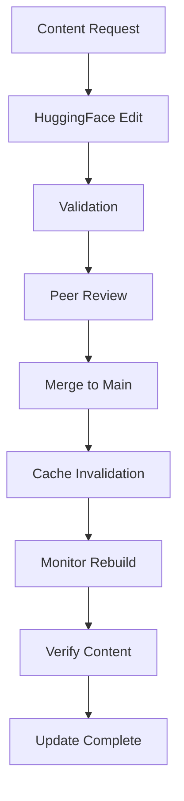

# Cloudflare CMS Migration - Admin Content Management Guide

## Table of Contents
- [HuggingFace Editing Workflow](#huggingface-editing-workflow)
- [Cache Invalidation Procedures](#cache-invalidation-procedures)
- [Content Update Process](#content-update-process)
- [Backup and Restore Procedures](#backup-and-restore-procedures)
- [Admin Dashboard Usage](#admin-dashboard-usage)
- [Content Migration Tools](#content-migration-tools)
- [Troubleshooting Common Issues](#troubleshooting-common-issues)
- [Best Practices](#best-practices)

## HuggingFace Editing Workflow

### HuggingFace Overview

HuggingFace serves as the source of truth for all CMS content in the Cloudflare CMS architecture. All content edits must be made through HuggingFace datasets and then propagated through the system.

### Accessing HuggingFace Datasets

```bash
# Install HuggingFace CLI
pip install huggingface_hub

# Authenticate with HuggingFace
huggingface-cli login

# Clone dataset for editing
git lfs install
git clone https://huggingface.co/datasets/your-org/your-dataset
cd your-dataset
```

### Content Structure

```markdown
# Dataset Structure

your-dataset/
├── README.md              # Dataset documentation
├── dataset_info.json      # Dataset metadata
├── data/                  # Main data directory
│   ├── locations/         # Location-based content
│   │   ├── austin-tx/     # Austin, TX content
│   │   │   ├── businesses.json  # Business listings
│   │   │   ├── faqs.json        # FAQ content
│   │   │   └── metadata.json    # Location metadata
│   │   ├── dallas-tx/     # Dallas, TX content
│   │   └── ...
│   └── services/          # Service-based content
│       ├── plumbing/      # Plumbing services
│       └── ...
└── .gitattributes         # Git LFS configuration
```

### Editing Content

```bash
# Edit content files
nano data/locations/austin-tx/businesses.json

# Validate JSON structure
jq . data/locations/austin-tx/businesses.json

# Test content changes locally
python validate_content.py
```

### Content Validation

```python
# validate_content.py - Example validation script
import json
import jsonschema
from pathlib import Path

def validate_content():
    schema = {
        "type": "object",
        "properties": {
            "businesses": {
                "type": "array",
                "items": {
                    "type": "object",
                    "required": ["id", "name", "address", "phone"],
                    "properties": {
                        "id": {"type": "string"},
                        "name": {"type": "string"},
                        "address": {"type": "string"},
                        "phone": {"type": "string"},
                        "website": {"type": "string"},
                        "hours": {"type": "object"}
                    }
                }
            }
        }
    }
    
    # Validate all location files
    for location_dir in Path("data/locations").glob("*"):
        businesses_file = location_dir / "businesses.json"
        if businesses_file.exists():
            with open(businesses_file) as f:
                data = json.load(f)
                jsonschema.validate(data, schema)
                print(f"✓ {businesses_file} is valid")

if __name__ == "__main__":
    validate_content()
```

### Committing Changes

```bash
# Commit changes to HuggingFace
git add data/locations/austin-tx/businesses.json
git commit -m "Update Austin plumbing businesses"
git push origin main

# Create new dataset version
huggingface-cli dataset-create --dataset your-org/your-dataset --version v2.1.0
```

### Content Review Process

1. **Draft Changes**: Make edits in a feature branch
2. **Validate Content**: Run validation scripts
3. **Peer Review**: Get team approval
4. **Test Locally**: Verify changes work
5. **Merge to Main**: Update production dataset
6. **Trigger Rebuild**: Update all affected pages

## Cache Invalidation Procedures

### Cache Invalidation Overview

The Cloudflare CMS uses a three-tier caching system that requires careful cache invalidation when content changes:

1. **KV Cache**: Hot cache (1 hour TTL)
2. **R2 Storage**: Warm cache (30 day retention)
3. **HuggingFace**: Source of truth

### Manual Cache Invalidation

```bash
# Invalidate specific page cache
curl -X POST https://cms-api.yourdomain.com/api/admin/invalidate-cache \
  -H "Authorization: Bearer your-admin-secret" \
  -H "Content-Type: application/json" \
  -d '{"pages": ["austin-tx/plumbing", "dallas-tx/electrician"]}'

# Invalidate all cache (use with caution)
curl -X POST https://cms-api.yourdomain.com/api/admin/invalidate-all \
  -H "Authorization: Bearer your-admin-secret"
```

### Automated Cache Invalidation

```typescript
// workers/cms-api/src/admin.ts
async function invalidateCache(env: Env, pages: string[]): Promise<void> {
  // Invalidate KV cache
  for (const page of pages) {
    await env.KV.delete(page);
  }
  
  // Mark R2 objects for rebuild
  for (const page of pages) {
    const [location, service] = page.split('/');
    const r2Key = `processed/${location}/${service}/complete.json.gz`;
    
    // Delete from R2 to force rebuild
    await env.R2.delete(r2Key);
    
    // Update D1 to mark artifact as missing
    await env.DB.prepare(
      `UPDATE page_heat SET artifact_exists = 0 WHERE page_key = ?`
    ).bind(page).run();
  }
  
  // Log invalidation
  console.log(`Cache invalidated for pages: ${pages.join(', ')}`);
}
```

### Cache Invalidation Strategies

| Strategy | When to Use | Impact | Command |
|----------|-------------|--------|---------|
| **Single Page** | Individual content update | Low | `invalidate-cache --page page-key` |
| **Location** | All content in a location | Medium | `invalidate-cache --location austin-tx` |
| **Service** | All content for a service | Medium | `invalidate-cache --service plumbing` |
| **Full Cache** | Major content restructuring | High | `invalidate-all` |
| **Pattern** | Multiple related pages | Medium | `invalidate-cache --pattern "tx/*"` |

### Scheduled Cache Invalidation

```bash
# Set up cron job for regular cache refresh
wrangler cron trigger create "0 4 * * *" \
  --env production \
  --command "invalidate-stale-cache"

# Configure stale cache threshold
wrangler var set --env production CACHE_STALE_THRESHOLD 24
```

## Content Update Process

### Standard Content Update Workflow



### Step-by-Step Update Process

1. **Receive Content Update Request**
   - Document request details
   - Assign to content editor
   - Set priority and deadline

2. **Edit Content in HuggingFace**
   - Clone dataset repository
   - Make required changes
   - Validate JSON structure
   - Test locally

3. **Submit for Review**
   - Create pull request
   - Assign reviewers
   - Address feedback
   - Get approval

4. **Merge Changes**
   - Merge to main branch
   - Create new dataset version
   - Update version in system

5. **Invalidate Cache**
   - Identify affected pages
   - Run cache invalidation
   - Monitor rebuild process

6. **Verify Update**
   - Check content displays correctly
   - Test all affected pages
   - Verify no broken links
   - Confirm SEO metadata

7. **Communicate Completion**
   - Notify requester
   - Update documentation
   - Log change in changelog

### Bulk Content Updates

```bash
# Bulk update script
python scripts/bulk-update.py \
  --input updates.csv \
  --dataset your-dataset \
  --dry-run

# Apply updates
python scripts/bulk-update.py \
  --input updates.csv \
  --dataset your-dataset \
  --apply
```

### Content Update Script Example

```python
# scripts/bulk-update.py
import pandas as pd
import json
from pathlib import Path
from huggingface_hub import HfApi

def bulk_update(input_file, dataset_name, dry_run=True):
    # Load updates
    updates = pd.read_csv(input_file)
    
    # Clone dataset
    api = HfApi()
    dataset = api.dataset_info(dataset_name)
    
    # Process each update
    for _, update in updates.iterrows():
        location = update['location']
        service = update['service']
        business_id = update['business_id']
        field = update['field']
        value = update['value']
        
        # Load current data
        file_path = Path(f"data/locations/{location}/{service}/businesses.json")
        with open(file_path) as f:
            data = json.load(f)
        
        # Find and update business
        business = next(b for b in data['businesses'] if b['id'] == business_id)
        business[field] = value
        
        if dry_run:
            print(f"Would update {location}/{service} - {business_id} - {field}: {value}")
        else:
            # Save changes
            with open(file_path, 'w') as f:
                json.dump(data, f, indent=2)
            
            print(f"Updated {location}/{service} - {business_id} - {field}: {value}")
    
    if not dry_run:
        # Commit changes
        api.upload_file(
            path_or_fileobj=file_path,
            path_in_repo=f"data/locations/{location}/{service}/businesses.json",
            repo_id=dataset_name,
            repo_type="dataset"
        )

if __name__ == "__main__":
    import argparse
    parser = argparse.ArgumentParser()
    parser.add_argument('--input', required=True)
    parser.add_argument('--dataset', required=True)
    parser.add_argument('--dry-run', action='store_true')
    args = parser.parse_args()
    
    bulk_update(args.input, args.dataset, args.dry_run)
```

## Backup and Restore Procedures

### Backup Strategy

| Component | Backup Frequency | Method | Retention |
|-----------|------------------|--------|-----------|
| HuggingFace | Continuous | Git | Permanent |
| R2 Storage | Weekly | R2 Sync | 90 days |
| D1 Database | Daily | D1 Export | 30 days |
| KV Cache | Not backed up | N/A | N/A |

### Creating Backups

```bash
# Backup HuggingFace dataset
git clone https://huggingface.co/datasets/your-org/your-dataset
tar -czvf hf-backup-$(date +%Y-%m-%d).tar.gz your-dataset/

# Backup R2 storage
wrangler r2 sync cms-artifacts-production s3://backup-bucket/cms-r2/$(date +%Y-%m-%d)

# Backup D1 database
wrangler d1 backup create cms-analytics-production --env production
BACKUP_ID=$(wrangler d1 backup list --env production | grep "Completed" | head -n 1 | awk '{print $1}')
wrangler d1 backup download $BACKUP_ID --env production --output d1-backup-$(date +%Y-%m-%d).sql
```

### Restoring from Backup

```bash
# Restore HuggingFace dataset
tar -xzvf hf-backup-2024-12-29.tar.gz
cd your-dataset
git push origin main --force

# Restore R2 storage
wrangler r2 sync s3://backup-bucket/cms-r2/2024-12-29 cms-artifacts-production

# Restore D1 database
wrangler d1 backup restore backup-id --env production
```

### Automated Backup Script

```bash
#!/bin/bash
# cms-backup.sh - Automated backup script

BACKUP_DIR="/backups/cms/$(date +%Y-%m-%d)"
mkdir -p $BACKUP_DIR

# Backup HuggingFace
echo "Backing up HuggingFace dataset..."
git clone https://huggingface.co/datasets/your-org/your-dataset $BACKUP_DIR/hf-dataset
tar -czvf $BACKUP_DIR/hf-backup.tar.gz -C $BACKUP_DIR hf-dataset

# Backup R2
echo "Backing up R2 storage..."
wrangler r2 sync cms-artifacts-production $BACKUP_DIR/r2-backup

# Backup D1
echo "Backing up D1 database..."
BACKUP_ID=$(wrangler d1 backup create cms-analytics-production --env production --json | jq -r '.id')
wrangler d1 backup download $BACKUP_ID --env production --output $BACKUP_DIR/d1-backup.sql

# Upload to cloud storage
echo "Uploading to cloud storage..."
aws s3 cp $BACKUP_DIR s3://your-backup-bucket/cms/$(date +%Y-%m-%d) --recursive

# Clean up
echo "Cleaning up..."
rm -rf $BACKUP_DIR

echo "Backup completed successfully!"
```

### Disaster Recovery Plan

```markdown
# CMS Disaster Recovery Plan

## Recovery Scenarios

### Scenario 1: Content Corruption
**Detection:** Invalid content displayed, user reports
**Response:**
1. Identify corrupted content
2. Restore from last known good backup
3. Invalidate affected cache
4. Monitor rebuild process
5. Verify content integrity

### Scenario 2: Database Failure
**Detection:** D1 query failures, error logs
**Response:**
1. Failover to read replica
2. Restore from backup
3. Rebuild affected indexes
4. Verify data consistency
5. Update monitoring

### Scenario 3: Storage Failure
**Detection:** R2 access errors, missing objects
**Response:**
1. Switch to backup storage
2. Restore missing objects
3. Update cache invalidation
4. Monitor rebuild process
5. Verify all content available

### Scenario 4: Complete System Failure
**Detection:** Total service outage
**Response:**
1. Activate disaster recovery site
2. Restore all components from backup
3. Test system functionality
4. Gradual traffic redirection
5. Full system verification

## Recovery Time Objectives
- **Content Corruption:** 15 minutes
- **Database Failure:** 30 minutes
- **Storage Failure:** 1 hour
- **Complete System Failure:** 4 hours

## Testing Schedule
- **Monthly:** Test backup restoration
- **Quarterly:** Full disaster recovery drill
- **Annually:** Complete system failover test
```

## Admin Dashboard Usage

### Accessing the Admin Dashboard

```bash
# Access admin dashboard
https://cms-api.yourdomain.com/admin

# Authentication
Username: admin
Password: [your-admin-password]

# API access
curl https://cms-api.yourdomain.com/api/admin/stats \
  -H "Authorization: Bearer your-admin-secret"
```

### Dashboard Features

```markdown
# Admin Dashboard Features

## Overview Section
- System health status
- Current cache statistics
- Recent activity
- Alert notifications

## Content Management
- Content search and browse
- Edit content directly
- Bulk update tools
- Content validation

## Cache Management
- Cache statistics
- Manual invalidation
- Cache warmup tools
- Rebuild monitoring

## Monitoring
- Real-time metrics
- Historical trends
- Alert configuration
- Log viewer

## System Administration
- User management
- API key management
- Configuration settings
- Backup and restore
```

### Common Admin Tasks

```bash
# Check system health
curl https://cms-api.yourdomain.com/api/admin/health \
  -H "Authorization: Bearer your-admin-secret"

# Get cache statistics
curl https://cms-api.yourdomain.com/api/admin/cache-stats \
  -H "Authorization: Bearer your-admin-secret"

# List recent content changes
curl https://cms-api.yourdomain.com/api/admin/recent-changes \
  -H "Authorization: Bearer your-admin-secret"

# Trigger cache rebuild
curl -X POST https://cms-api.yourdomain.com/api/admin/rebuild-cache \
  -H "Authorization: Bearer your-admin-secret" \
  -H "Content-Type: application/json" \
  -d '{"locations": ["austin-tx"], "services": ["plumbing"]}'
```

## Content Migration Tools

### Migration from Sanity to Cloudflare

```bash
# Export from Sanity
node scripts/export-from-sanity.js \
  --project-id your-sanity-project \
  --dataset production \
  --output sanity-export.json

# Transform to HuggingFace format
node scripts/transform-to-hf.js \
  --input sanity-export.json \
  --output hf-dataset/

# Validate transformed data
python scripts/validate-hf-data.py

# Upload to HuggingFace
cd hf-dataset
git add .
git commit -m "Initial Sanity migration"
git push origin main
```

### Migration Scripts

```javascript
// scripts/export-from-sanity.js
const sanityClient = require('@sanity/client');
const fs = require('fs');

const client = sanityClient({
  projectId: process.env.SANITY_PROJECT_ID,
  dataset: process.env.SANITY_DATASET,
  token: process.env.SANITY_TOKEN,
  useCdn: false
});

async function exportFromSanity() {
  // Query all businesses
  const businesses = await client.fetch('*[_type == "business"]');
  
  // Query all locations
  const locations = await client.fetch('*[_type == "location"]');
  
  // Query all services
  const services = await client.fetch('*[_type == "service"]');
  
  // Transform to intermediate format
  const exportData = {
    businesses,
    locations,
    services,
    timestamp: new Date().toISOString()
  };
  
  // Save to file
  fs.writeFileSync('sanity-export.json', JSON.stringify(exportData, null, 2));
  
  console.log('Sanity export completed successfully!');
}

exportFromSanity().catch(console.error);
```

### Content Transformation

```python
# scripts/transform-to-hf.py
import json
import os
from pathlib import Path

def transform_sanity_to_hf(sanity_file, output_dir):
    # Load Sanity export
    with open(sanity_file) as f:
        sanity_data = json.load(f)
    
    # Create output structure
    output_dir = Path(output_dir)
    locations_dir = output_dir / "data" / "locations"
    locations_dir.mkdir(parents=True, exist_ok=True)
    
    # Group businesses by location and service
    location_service_map = {}
    
    for business in sanity_data['businesses']:
        location = business['location']['slug']
        service = business['service']['slug']
        
        if location not in location_service_map:
            location_service_map[location] = {}
        
        if service not in location_service_map[location]:
            location_service_map[location][service] = []
        
        location_service_map[location][service].append(business)
    
    # Create HuggingFace dataset structure
    for location, services in location_service_map.items():
        location_dir = locations_dir / location
        location_dir.mkdir(exist_ok=True)
        
        for service, businesses in services.items():
            service_dir = location_dir / service
            service_dir.mkdir(exist_ok=True)
            
            # Create businesses.json
            businesses_file = service_dir / "businesses.json"
            with open(businesses_file, 'w') as f:
                json.dump({"businesses": businesses}, f, indent=2)
            
            # Create metadata
            metadata = {
                "location": location,
                "service": service,
                "business_count": len(businesses),
                "last_updated": sanity_data['timestamp']
            }
            
            with open(service_dir / "metadata.json", 'w') as f:
                json.dump(metadata, f, indent=2)
    
    print(f"Transformation completed. Created {len(location_service_map)} locations with {sum(len(s) for s in location_service_map.values())} services.")

if __name__ == "__main__":
    import argparse
    parser = argparse.ArgumentParser()
    parser.add_argument('--input', required=True, help='Sanity export file')
    parser.add_argument('--output', required=True, help='Output directory')
    args = parser.parse_args()
    
    transform_sanity_to_hf(args.input, args.output)
```

## Troubleshooting Common Issues

### Content Not Updating

**Symptoms:**
- Changes not appearing on website
- Stale content being served
- Cache not invalidating

**Solutions:**
1. Check cache invalidation logs
2. Verify HuggingFace changes were merged
3. Manually invalidate cache
4. Check rebuild process status
5. Verify content validation passed

```bash
# Check cache status
curl https://cms-api.yourdomain.com/api/admin/cache-status \
  -H "Authorization: Bearer your-admin-secret"

# Force cache invalidation
curl -X POST https://cms-api.yourdomain.com/api/admin/invalidate-cache \
  -H "Authorization: Bearer your-admin-secret" \
  -d '{"pages": ["austin-tx/plumbing"]}'
```

### Validation Errors

**Symptoms:**
- Content validation fails
- JSON schema errors
- Missing required fields

**Solutions:**
1. Run validation script locally
2. Check JSON structure
3. Verify required fields
4. Fix validation errors
5. Re-test before committing

```bash
# Run validation
python scripts/validate_content.py

# Check specific file
jq . data/locations/austin-tx/plumbing/businesses.json
```

### Cache Invalidation Failures

**Symptoms:**
- Cache invalidation returns errors
- Content still stale after invalidation
- Invalidation API fails

**Solutions:**
1. Check admin API logs
2. Verify authentication
3. Check KV namespace permissions
4. Test with smaller batch
5. Restart worker if needed

```bash
# Check invalidation logs
wrangler tail --env production | grep "invalidate"

# Test invalidation with single page
curl -X POST https://cms-api.yourdomain.com/api/admin/invalidate-cache \
  -H "Authorization: Bearer your-admin-secret" \
  -d '{"pages": ["austin-tx/plumbing"]}'
```

### Performance Issues During Updates

**Symptoms:**
- Slow response times during updates
- High CPU usage
- Increased error rates

**Solutions:**
1. Stagger large updates
2. Use off-peak hours
3. Monitor system during updates
4. Limit concurrent rebuilds
5. Optimize rebuild process

```bash
# Monitor during updates
wrangler tail --env production | grep "rebuild"

# Limit rebuild concurrency
wrangler var set --env production MAX_CONCURRENT_REBUILDS 5
```

## Best Practices

### Content Management Best Practices

1. **Use Feature Branches**: Always work in branches, never directly in main
2. **Validate Early**: Run validation before committing
3. **Test Locally**: Verify changes work before merging
4. **Document Changes**: Keep changelog updated
5. **Stagger Large Updates**: Break big changes into smaller batches
6. **Monitor After Updates**: Watch for issues post-deployment
7. **Communicate Changes**: Notify team of major updates
8. **Backup Before Major Changes**: Always have a rollback plan
9. **Use Semantic Versioning**: Clear version numbering
10. **Regular Audits**: Review content quality periodically

### Cache Management Best Practices

1. **Invalidate Strategically**: Only invalidate what's necessary
2. **Monitor Cache Ratios**: Track hit/miss performance
3. **Adjust TTLs**: Balance freshness and performance
4. **Warm Cache Gradually**: Don't overload system with sudden rebuilds
5. **Test Invalidation**: Verify cache clearing works
6. **Use Pattern Matching**: Invalidate related content together
7. **Schedule Regular Cleanup**: Prevent cache bloat
8. **Monitor Storage**: Track R2 and KV usage
9. **Optimize Cache Keys**: Use efficient naming
10. **Document Cache Strategy**: Keep team informed

### Backup Best Practices

1. **Automate Backups**: Regular, scheduled backups
2. **Test Restores**: Verify backups work
3. **Multiple Locations**: Store backups in different regions
4. **Version Backups**: Keep multiple backup versions
5. **Encrypt Sensitive Data**: Protect backup contents
6. **Monitor Backup Jobs**: Ensure they complete successfully
7. **Document Restore Process**: Clear procedures for emergencies
8. **Regular Backup Audits**: Verify backup integrity
9. **Include All Components**: Database, storage, and code
10. **Train Team**: Ensure everyone knows backup procedures

### Security Best Practices

1. **Use Strong Authentication**: Secure admin access
2. **Rotate Secrets Regularly**: Change API keys periodically
3. **Limit Access**: Only necessary team members
4. **Audit Logs**: Monitor admin activities
5. **Encrypt Sensitive Data**: Protect user information
6. **Use HTTPS**: Secure all communications
7. **Regular Security Audits**: Check for vulnerabilities
8. **Keep Software Updated**: Patch dependencies
9. **Monitor for Breaches**: Watch for unusual activity
10. **Have Incident Response Plan**: Prepare for security events

## Conclusion

This Admin Content Management Guide provides comprehensive instructions for managing content in the Cloudflare CMS system. By following these procedures for HuggingFace editing, cache invalidation, content updates, and backup management, administrators can ensure smooth content operations while maintaining system performance and reliability.