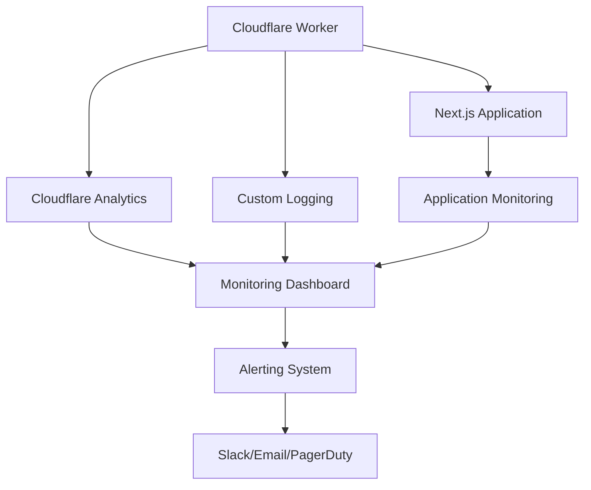
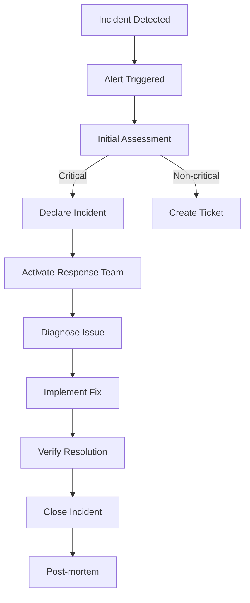

# Cloudflare CMS Migration - Monitoring Guide

## Table of Contents
- [Monitoring Overview](#monitoring-overview)
- [Worker Monitoring Commands](#worker-monitoring-commands)
- [Key Metrics to Track](#key-metrics-to-track)
- [Error Handling and Alerting](#error-handling-and-alerting)
- [Performance Optimization Tips](#performance-optimization-tips)
- [Monitoring Setup](#monitoring-setup)
- [Alert Configuration](#alert-configuration)
- [Dashboard Setup](#dashboard-setup)
- [Log Management](#log-management)
- [Incident Response](#incident-response)

## Monitoring Overview

### Monitoring Architecture



### Monitoring Goals

1. **Proactive Issue Detection**: Identify problems before users notice
2. **Performance Optimization**: Maintain sub-100ms response times
3. **Cost Control**: Monitor usage to stay within budget
4. **Reliability**: Ensure 99.9% uptime
5. **User Experience**: Track real user metrics

## Worker Monitoring Commands

### Basic Monitoring Commands

```bash
# Tail worker logs in real-time
wrangler tail --env production

# View historical logs
wrangler logs --env production --since "1 hour ago"

# Filter logs by level
wrangler tail --env production --format pretty --level error

# Monitor specific worker
wrangler tail --env production --name cms-api
```

### Advanced Monitoring Commands

```bash
# Monitor with custom formatting
wrangler tail --env production --format json | jq '.message'

# Save logs to file
wrangler logs --env production --since "24 hours ago" > worker-logs-$(date +%Y-%m-%d).json

# Monitor multiple workers
wrangler tail --env production --name cms-api --name other-worker

# Set up log forwarding
wrangler logpush set --env production --url https://your-log-service.com/api/logs
```

### Worker Metrics Commands

```bash
# Get worker metrics
wrangler analytics --env production

# Get request counts
wrangler analytics --env production --metric requests

# Get error rates
wrangler analytics --env production --metric errors

# Get response times
wrangler analytics --env production --metric duration
```

## Key Metrics to Track

### Critical Metrics

| Metric | Target | Description | Alert Threshold |
|--------|--------|-------------|-----------------|
| **Request Count** | N/A | Total requests per minute | > 10,000/min sustained |
| **Error Rate** | < 1% | Percentage of failed requests | > 5% for 5 minutes |
| **Response Time** | < 100ms | Average response time | > 500ms for 1 minute |
| **Cache Hit Ratio** | > 80% | KV + R2 cache hits | < 60% for 15 minutes |
| **Memory Usage** | < 128MB | Worker memory consumption | > 200MB for 5 minutes |
| **CPU Time** | < 50ms | CPU time per request | > 100ms for 1 minute |
| **D1 Query Time** | < 20ms | Database query duration | > 50ms for 5 minutes |
| **R2 Latency** | < 30ms | R2 storage access time | > 100ms for 5 minutes |
| **KV Latency** | < 5ms | KV cache access time | > 10ms for 5 minutes |
| **Rebuild Rate** | < 5% | Percentage of cache misses requiring rebuild | > 10% for 15 minutes |

### Performance Metrics

```javascript
// Key performance metrics to monitor
const performanceMetrics = {
  // Cache effectiveness
  cacheHitRatio: {
    target: 0.8,
    critical: 0.6,
    description: "Percentage of requests served from cache"
  },
  
  // Response times
  p99ResponseTime: {
    target: 100,
    critical: 500,
    description: "99th percentile response time in ms"
  },
  
  // Error rates
  errorRate: {
    target: 0.01,
    critical: 0.05,
    description: "Percentage of requests resulting in errors"
  },
  
  // Resource usage
  memoryUsage: {
    target: 100,
    critical: 200,
    description: "Average memory usage per request in MB"
  },
  
  // Storage metrics
  r2StorageUsed: {
    target: 50,
    critical: 100,
    description: "R2 storage used in GB"
  },
  
  // Database metrics
  d1QueryTime: {
    target: 20,
    critical: 50,
    description: "Average D1 query time in ms"
  }
};
```

### Business Metrics

```javascript
// Business-related metrics
const businessMetrics = {
  // Content metrics
  activePages: {
    description: "Number of active pages in cache"
  },
  
  // User engagement
  pageViews: {
    description: "Total page views per minute"
  },
  
  // Content freshness
  averageContentAge: {
    description: "Average age of cached content in hours"
  },
  
  // Migration progress
  migrationCompletion: {
    description: "Percentage of content migrated to Cloudflare"
  }
};
```

## Error Handling and Alerting

### Error Classification

| Error Type | Severity | Description | Response |
|------------|----------|-------------|----------|
| **Critical** | P0 | System down, data loss | Immediate rollback |
| **High** | P1 | Major functionality broken | Rollback within 30 min |
| **Medium** | P2 | Partial functionality broken | Fix within 2 hours |
| **Low** | P3 | Minor issues | Fix in next sprint |
| **Monitoring** | P4 | Performance degradation | Investigate within 24h |

### Error Handling Patterns

```typescript
// Comprehensive error handling in worker
async function handleRequestWithFallbacks(
  request: Request,
  env: Env,
  ctx: ExecutionContext
): Promise<Response> {
  try {
    // Primary path: Cloudflare CMS
    return await handleCloudflareRequest(request, env, ctx);
  } catch (primaryError) {
    logError(env, 'PRIMARY_FAILED', { error: primaryError.message });
    
    try {
      // Fallback 1: R2 cache
      return await handleR2Fallback(request, env, ctx);
    } catch (r2Error) {
      logError(env, 'R2_FALLBACK_FAILED', { error: r2Error.message });
      
      try {
        // Fallback 2: Sanity CMS
        return await handleSanityFallback(request, env, ctx);
      } catch (sanityError) {
        logError(env, 'SANITY_FALLBACK_FAILED', { error: sanityError.message });
        
        // Final fallback: Error response
        return createErrorResponse(503, 'Service Unavailable', {
          error: 'All CMS systems unavailable',
          retryAfter: 300
        });
      }
    }
  }
}

// Error logging function
async function logError(env: Env, errorType: string, data: any): Promise<void> {
  const errorData = {
    timestamp: new Date().toISOString(),
    type: errorType,
    severity: getSeverity(errorType),
    ...data,
    workerVersion: env.WORKER_VERSION
  };
  
  // Log to console
  console.error(JSON.stringify(errorData));
  
  // Send to error tracking service
  if (env.ERROR_TRACKING_URL) {
    ctx.waitUntil(fetch(env.ERROR_TRACKING_URL, {
      method: 'POST',
      body: JSON.stringify(errorData),
      headers: { 'Content-Type': 'application/json' }
    }));
  }
  
  // Store in D1 for analysis
  if (env.DB) {
    ctx.waitUntil(env.DB.prepare(
      `INSERT INTO errors (timestamp, type, severity, details) VALUES (?, ?, ?, ?)`
    ).bind(
      errorData.timestamp,
      errorType,
      errorData.severity,
      JSON.stringify(data)
    ).run());
  }
}
```

### Alert Configuration

```yaml
# Example alert configuration for Cloudflare CMS
alerts:
  - name: "High Error Rate"
    description: "Error rate exceeds 5% for 5 minutes"
    condition: "error_rate > 5"
    duration: "5 minutes"
    severity: "P0"
    notifications:
      - pagerduty: "cloudflare-cms-pagerduty-key"
      - slack: "#critical-alerts"
      - email: "dev-team@yourdomain.com"
    
  - name: "Slow Response Times"
    description: "P99 response time exceeds 500ms"
    condition: "p99_response_time > 500"
    duration: "1 minute"
    severity: "P1"
    notifications:
      - slack: "#performance-alerts"
      - email: "performance-team@yourdomain.com"
    
  - name: "Low Cache Hit Ratio"
    description: "Cache hit ratio below 60%"
    condition: "cache_hit_ratio < 60"
    duration: "15 minutes"
    severity: "P2"
    notifications:
      - slack: "#monitoring-alerts"
    
  - name: "High Rebuild Rate"
    description: "Rebuild rate exceeds 10%"
    condition: "rebuild_rate > 10"
    duration: "15 minutes"
    severity: "P2"
    notifications:
      - slack: "#cms-alerts"
    
  - name: "D1 Query Performance"
    description: "D1 query time exceeds 50ms"
    condition: "d1_query_time > 50"
    duration: "5 minutes"
    severity: "P1"
    notifications:
      - pagerduty: "database-pagerduty-key"
      - slack: "#database-alerts"
```

### Alert Escalation Policy

```markdown
# Alert Escalation Policy

## P0 Alerts (Critical)
- **Initial Response**: Immediate (within 5 minutes)
- **Team**: On-call engineer + backup
- **Escalation**: If not acknowledged in 5 minutes
- **Resolution Target**: 30 minutes
- **Communication**: Update status page immediately

## P1 Alerts (High)
- **Initial Response**: Within 15 minutes
- **Team**: On-call engineer
- **Escalation**: If not resolved in 1 hour
- **Resolution Target**: 2 hours
- **Communication**: Update status page if user impact

## P2 Alerts (Medium)
- **Initial Response**: Within 30 minutes
- **Team**: Next business day response
- **Escalation**: If not resolved in 4 hours
- **Resolution Target**: 8 hours
- **Communication**: Internal notification only

## P3 Alerts (Low)
- **Initial Response**: Within 2 hours
- **Team**: Next sprint planning
- **Escalation**: If recurring
- **Resolution Target**: Next sprint
- **Communication**: Ticket creation only
```

## Performance Optimization Tips

### Cache Optimization

```typescript
// Cache optimization strategies
const cacheStrategies = {
  // Tiered caching with automatic promotion
  tieredCaching: {
    description: "KV → R2 → HuggingFace with auto-promotion",
    implementation: "Promote R2 hits to KV after 3 accesses in 1 hour"
  },
  
  // Intelligent TTL management
  dynamicTTL: {
    description: "Adjust TTL based on content popularity",
    implementation: "Hot content: 1 hour, Warm content: 4 hours, Cold content: 8 hours"
  },
  
  // Cache key optimization
  optimizedKeys: {
    description: "Use efficient cache keys",
    implementation: "location/service instead of full URL"
  },
  
  // Cache compression
  compression: {
    description: "Compress all cached responses",
    implementation: "Gzip compression for all JSON responses"
  }
};
```

### Performance Tuning

```javascript
// Performance optimization checklist
const performanceChecklist = [
  {
    item: "Enable compression for all responses",
    implementation: "Use gzip or brotli compression",
    impact: "60-80% bandwidth reduction"
  },
  {
    item: "Use async operations with ctx.waitUntil",
    implementation: "Move non-critical operations to background",
    impact: "Reduced response times"
  },
  {
    item: "Optimize database queries",
    implementation: "Add proper indexes, batch operations",
    impact: "Faster D1 queries"
  },
  {
    item: "Implement edge caching",
    implementation: "Use Cloudflare cache headers",
    impact: "Reduced origin load"
  },
  {
    item: "Monitor and adjust cache TTLs",
    implementation: "Balance hit rate and freshness",
    impact: "Better cache efficiency"
  },
  {
    item: "Use efficient data structures",
    implementation: "Minimize memory usage",
    impact: "Lower memory costs"
  },
  {
    item: "Batch cleanup operations",
    implementation: "Process deletions in batches",
    impact: "Reduced database load"
  },
  {
    item: "Monitor cold start times",
    implementation: "Optimize worker initialization",
    impact: "Faster first requests"
  }
];
```

### Cost Optimization

```javascript
// Cost optimization strategies
const costOptimization = {
  storage: {
    strategies: [
      "Compress all R2 objects (60-80% savings)",
      "Set appropriate retention periods (30/90 days)",
      "Monitor and clean up unused objects",
      "Use intelligent cache eviction"
    ]
  },
  compute: {
    strategies: [
      "Optimize worker execution time",
      "Reduce CPU-intensive operations",
      "Use efficient algorithms",
      "Monitor and alert on high CPU usage"
    ]
  },
  bandwidth: {
    strategies: [
      "Enable compression",
      "Use cache headers effectively",
      "Minimize response payload sizes",
      "Use edge caching"
    ]
  },
  database: {
    strategies: [
      "Optimize D1 queries",
      "Batch database operations",
      "Use proper indexing",
      "Monitor query performance"
    ]
  }
};
```

## Monitoring Setup

### Cloudflare Monitoring Setup

```bash
# Set up Cloudflare monitoring
wrangler analytics --env production --setup

# Configure custom metrics
wrangler analytics metric create --name cache_hit_ratio \
  --description "Percentage of requests served from cache" \
  --type gauge \
  --env production

# Set up dashboards
wrangler analytics dashboard create --name "CMS Performance" \
  --metrics requests,error_rate,p99_response_time,cache_hit_ratio \
  --env production
```

### Third-party Monitoring Integration

```javascript
// Datadog integration example
import { datadog } from '@datadog/datadog-api-client';

const configuration = datadog.createConfiguration();
const apiInstance = new datadog.v1.MetricsApi(configuration);

async function sendMetricsToDatadog(env: Env, metrics: any) {
  try {
    const body: datadog.v1.MetricsPayload = {
      series: [
        {
          metric: 'cloudflare.cms.requests',
          points: [[Math.floor(Date.now() / 1000), metrics.requestCount]],
          tags: ['env:production', 'service:cms']
        },
        {
          metric: 'cloudflare.cms.errors',
          points: [[Math.floor(Date.now() / 1000), metrics.errorCount]],
          tags: ['env:production', 'service:cms']
        },
        {
          metric: 'cloudflare.cms.response_time',
          points: [[Math.floor(Date.now() / 1000), metrics.avgResponseTime]],
          tags: ['env:production', 'service:cms']
        }
      ]
    };
    
    await apiInstance.submitMetrics({ body });
  } catch (error) {
    console.error('Datadog metrics submission failed:', error);
  }
}
```

### Custom Monitoring Dashboard

```json
// Example Grafana dashboard configuration
{
  "title": "Cloudflare CMS Monitoring",
  "panels": [
    {
      "title": "Request Volume",
      "type": "graph",
      "targets": [
        {
          "expr": "sum(rate(cloudflare_cms_requests_total[1m]))",
          "legendFormat": "Requests/s"
        }
      ]
    },
    {
      "title": "Error Rate",
      "type": "graph",
      "targets": [
        {
          "expr": "sum(rate(cloudflare_cms_errors_total[1m])) / sum(rate(cloudflare_cms_requests_total[1m])) * 100",
          "legendFormat": "Error %"
        }
      ],
      "thresholds": [
        {
          "value": 1,
          "color": "green"
        },
        {
          "value": 5,
          "color": "orange"
        },
        {
          "value": 10,
          "color": "red"
        }
      ]
    },
    {
      "title": "Response Time",
      "type": "graph",
      "targets": [
        {
          "expr": "histogram_quantile(0.99, sum(rate(cloudflare_cms_response_time_bucket[1m])) by (le))",
          "legendFormat": "P99 {{le}}"
        },
        {
          "expr": "histogram_quantile(0.95, sum(rate(cloudflare_cms_response_time_bucket[1m])) by (le))",
          "legendFormat": "P95 {{le}}"
        }
      ]
    },
    {
      "title": "Cache Hit Ratio",
      "type": "singlestat",
      "targets": [
        {
          "expr": "sum(cloudflare_cms_cache_hits_total) / sum(cloudflare_cms_cache_requests_total) * 100",
          "legendFormat": "Cache Hit %"
        }
      ]
    }
  ]
}
```

## Alert Configuration

### Cloudflare Alert Setup

```bash
# Create alert policies
wrangler alert create --name "High Error Rate" \
  --condition "error_rate > 5" \
  --duration "5 minutes" \
  --severity "P0" \
  --notifications slack:#critical-alerts,pagerduty:cloudflare-key \
  --env production

# List existing alerts
wrangler alert list --env production

# Test alert notification
wrangler alert test --name "High Error Rate" --env production
```

### Multi-channel Alerting

```javascript
// Multi-channel alerting system
async function sendAlert(env: Env, alert: Alert) {
  const channels = [
    {
      name: 'Slack',
      enabled: env.SLACK_ALERTS === 'true',
      send: async (alert) => {
        return fetch(env.SLACK_WEBHOOK_URL, {
          method: 'POST',
          body: JSON.stringify({
            text: formatSlackAlert(alert),
            attachments: [createSlackAttachment(alert)]
          })
        });
      }
    },
    {
      name: 'PagerDuty',
      enabled: alert.severity === 'P0' || alert.severity === 'P1',
      send: async (alert) => {
        return fetch('https://events.pagerduty.com/v2/enqueue', {
          method: 'POST',
          body: JSON.stringify(createPagerDutyEvent(alert))
        });
      }
    },
    {
      name: 'Email',
      enabled: true,
      send: async (alert) => {
        return fetch(env.EMAIL_API_URL, {
          method: 'POST',
          body: JSON.stringify(createEmailAlert(alert))
        });
      }
    }
  ];
  
  // Send to all enabled channels
  await Promise.all(
    channels
      .filter(channel => channel.enabled)
      .map(channel => channel.send(alert))
  );
}
```

### Alert Suppression and Deduplication

```javascript
// Alert deduplication system
class AlertDeduplicator {
  private activeAlerts: Map<string, Alert>;
  private suppressionWindow: number;
  
  constructor(suppressionWindowMinutes = 30) {
    this.activeAlerts = new Map();
    this.suppressionWindow = suppressionWindowMinutes * 60 * 1000;
  }
  
  shouldSendAlert(alert: Alert): boolean {
    const alertKey = this.getAlertKey(alert);
    
    if (this.activeAlerts.has(alertKey)) {
      const existingAlert = this.activeAlerts.get(alertKey);
      
      // Suppress if same alert within suppression window
      if (Date.now() - existingAlert.timestamp < this.suppressionWindow) {
        return false;
      }
    }
    
    // Update or add alert
    this.activeAlerts.set(alertKey, {
      ...alert,
      timestamp: Date.now()
    });
    
    return true;
  }
  
  private getAlertKey(alert: Alert): string {
    return `${alert.name}:${alert.severity}`;
  }
  
  cleanupOldAlerts() {
    const now = Date.now();
    for (const [key, alert] of this.activeAlerts.entries()) {
      if (now - alert.timestamp > this.suppressionWindow) {
        this.activeAlerts.delete(key);
      }
    }
  }
}
```

## Dashboard Setup

### Recommended Dashboards

1. **Overview Dashboard**: High-level system health
2. **Performance Dashboard**: Response times, cache ratios
3. **Error Dashboard**: Error rates, types, trends
4. **Cost Dashboard**: Resource usage, spending
5. **User Experience Dashboard**: Real user metrics

### Dashboard Best Practices

```markdown
# Dashboard Best Practices

## Layout
- Group related metrics together
- Use consistent time ranges
- Prioritize critical metrics at top
- Use appropriate visualization types

## Metrics Selection
- Focus on actionable metrics
- Avoid metric overload
- Include historical context
- Show trends over time

## Alert Integration
- Highlight alert thresholds
- Show alert history
- Include alert suppression status
- Link to runbooks

## Maintenance
- Review dashboards monthly
- Remove unused metrics
- Update for new features
- Document dashboard purpose
```

## Log Management

### Log Retention Policy

| Log Type | Retention Period | Storage Location |
|----------|------------------|------------------|
| Worker Logs | 30 days | Cloudflare Logpush |
| Error Logs | 90 days | Error Tracking Service |
| Access Logs | 30 days | Cloud Storage |
| Audit Logs | 1 year | Secure Storage |
| Performance Logs | 7 days | Time Series Database |

### Log Rotation Script

```bash
#!/bin/bash
# log-rotation.sh - Rotate and archive logs

LOG_DIR="/var/log/cms"
ARCHIVE_DIR="/var/log/cms/archive"
MAX_SIZE="100M"
MAX_AGE="30"

# Create archive directory
mkdir -p $ARCHIVE_DIR

# Rotate logs
today=$(date +%Y-%m-%d)
for log in $LOG_DIR/*.log; do
  [ -f "$log" ] || continue
  
  # Check size
  size=$(du -m "$log" | cut -f1)
  if [ "$size" -gt "100" ]; then
    echo "Rotating $log (size: ${size}M)"
    
    # Compress and archive
    gzip -c "$log" > "$ARCHIVE_DIR/$(basename $log)-$today.gz"
    
    # Clear log file
    > "$log"
  fi
done

# Clean up old archives
find $ARCHIVE_DIR -name "*.gz" -mtime +$MAX_AGE -delete

echo "Log rotation completed"
```

### Log Analysis Tools

```bash
# Analyze logs with jq
cat worker-logs.json | jq '.[] | select(.level == "error")' | less

# Count errors by type
cat worker-logs.json | jq -r '.errorType' | sort | uniq -c | sort -nr

# Analyze response times
cat worker-logs.json | jq '.responseTime' | sort -n | head -100

# Find slow requests
cat worker-logs.json | jq 'select(.responseTime > 500)' | less
```

## Incident Response

### Incident Response Process



### Incident Response Checklist

**Initial Response:**
- [ ] Acknowledge alert
- [ ] Assess severity
- [ ] Notify team
- [ ] Update status page
- [ ] Begin diagnosis

**Diagnosis:**
- [ ] Check monitoring dashboards
- [ ] Review recent logs
- [ ] Identify affected components
- [ ] Determine root cause
- [ ] Estimate impact

**Resolution:**
- [ ] Implement fix or workaround
- [ ] Test fix in staging
- [ ] Deploy to production
- [ ] Monitor for regression
- [ ] Verify full resolution

**Post-incident:**
- [ ] Update documentation
- [ ] Create post-mortem report
- [ ] Schedule review meeting
- [ ] Implement preventive measures
- [ ] Update runbooks

### Incident Communication Template

```markdown
# Incident Report: [Incident Name]

## Summary
Brief description of the incident and its impact.

## Timeline
- **Detected:** [Time] by [Detection Method]
- **Acknowledged:** [Time] by [Team Member]
- **Severity:** [P0/P1/P2/P3]
- **Root Cause Identified:** [Time]
- **Resolution Implemented:** [Time]
- **Incident Closed:** [Time]

## Impact
- **Duration:** [Total Duration]
- **Affected Users:** [Number/Percentage]
- **Service Degradation:** [Description]
- **Data Loss:** [Yes/No, Details]

## Root Cause
Detailed technical explanation of what caused the incident.

## Resolution
Steps taken to resolve the incident and restore service.

## Preventive Measures
Actions to prevent recurrence:
- [ ] Implement additional monitoring
- [ ] Add automated tests
- [ ] Improve error handling
- [ ] Update documentation
- [ ] Conduct training

## Lessons Learned
Key takeaways from the incident.

## Action Items
| Item | Owner | Due Date | Status |
|------|-------|----------|--------|
| Implement monitoring | Dev Team | [Date] | Open |
| Update runbook | Ops Team | [Date] | Open |
| Conduct review | All Teams | [Date] | Open |

## Attachments
- Log files
- Monitoring screenshots
- Communication records
```

## Conclusion

This comprehensive monitoring guide provides the tools and strategies needed to effectively monitor the Cloudflare CMS migration. By implementing proper monitoring, alerting, and incident response procedures, the team can ensure high availability, optimal performance, and quick resolution of any issues that arise.