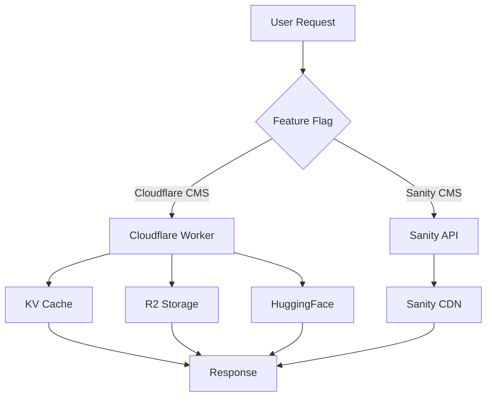

# Cloudflare CMS Migration - Rollback Strategy

## Table of Contents
- [Rollback Overview](#rollback-overview)
- [Feature Flag Implementation](#feature-flag-implementation)
- [Sanity Overlap Strategy](#sanity-overlap-strategy)
- [Data Backup Procedures](#data-backup-procedures)
- [Step-by-Step Rollback Procedures](#step-by-step-rollback-procedures)
- [Partial Rollback Strategies](#partial-rollback-strategies)
- [Testing Rollback Procedures](#testing-rollback-procedures)
- [Communication Plan](#communication-plan)

## Rollback Overview

### Rollback Principles

1. **Minimize Downtime**: Quickly restore service availability
2. **Data Integrity**: Ensure no data loss during rollback
3. **Clear Communication**: Keep all stakeholders informed
4. **Gradual Reversion**: Rollback components incrementally when possible
5. **Monitoring**: Continuously monitor during rollback process

### Rollback Triggers

Immediate rollback required if:
- Error rate > 5% for more than 5 minutes
- Response times > 2s for critical endpoints
- Data corruption detected
- Security vulnerabilities exposed
- Major functionality broken

Considered rollback if:
- Error rate > 2% but < 5%
- Performance degradation > 30%
- Minor data inconsistencies
- Non-critical functionality issues

## Feature Flag Implementation

### Feature Flag Architecture

```typescript
// Feature flag interface
export interface FeatureFlags {
  useCloudflareCMS: boolean;
  useSanityFallback: boolean;
  enableNewCacheStrategy: boolean;
  enableAdminDashboard: boolean;
}

// Feature flag service
class FeatureFlagService {
  private flags: FeatureFlags;
  
  constructor() {
    this.flags = this.loadFlags();
  }
  
  private loadFlags(): FeatureFlags {
    // Load from environment variables or remote config
    return {
      useCloudflareCMS: process.env.USE_CLOUDFLARE_CMS === 'true',
      useSanityFallback: process.env.USE_SANITY_FALLBACK === 'true',
      enableNewCacheStrategy: process.env.ENABLE_NEW_CACHE === 'true',
      enableAdminDashboard: process.env.ENABLE_ADMIN_DASHBOARD === 'true'
    };
  }
  
  isEnabled(flag: keyof FeatureFlags): boolean {
    return this.flags[flag];
  }
  
  async updateFlag(flag: keyof FeatureFlags, value: boolean): Promise<void> {
    // Update in database or remote config
    await this.saveFlag(flag, value);
    this.flags[flag] = value;
  }
}
```

### Feature Flag Implementation in Next.js

```typescript
// lib/feature-flags.ts
import { FeatureFlagService } from './feature-flag-service';

export const featureFlags = new FeatureFlagService();

// Usage in components
import { featureFlags } from '../lib/feature-flags';

const CMSComponent = () => {
  const useCloudflare = featureFlags.isEnabled('useCloudflareCMS');
  
  if (useCloudflare) {
    return <CloudflareCMS />;
  } else {
    return <SanityCMS />;
  }
};
```

### Feature Flag Implementation in Cloudflare Worker

```typescript
// workers/cms-api/src/feature-flags.ts
export function getFeatureFlags(env: Env): FeatureFlags {
  return {
    useCloudflareCMS: env.USE_CLOUDFLARE_CMS === 'true',
    useSanityFallback: env.USE_SANITY_FALLBACK === 'true',
    enableNewCacheStrategy: env.ENABLE_NEW_CACHE === 'true',
    enableAdminDashboard: env.ENABLE_ADMIN_DASHBOARD === 'true'
  };
}

// Usage in worker
export default {
  async fetch(request: Request, env: Env, ctx: ExecutionContext) {
    const flags = getFeatureFlags(env);
    
    if (!flags.useCloudflareCMS) {
      // Fallback to Sanity
      return await fetchFromSanity(request);
    }
    
    // Continue with Cloudflare CMS logic
    return await handleCloudflareRequest(request, env, ctx);
  }
};
```

### Feature Flag Management

```bash
# Enable Cloudflare CMS
wrangler var set --env production USE_CLOUDFLARE_CMS true

# Disable Cloudflare CMS (rollback to Sanity)
wrangler var set --env production USE_CLOUDFLARE_CMS false

# Enable Sanity fallback
wrangler var set --env production USE_SANITY_FALLBACK true

# Check current flag values
wrangler var list --env production
```

## Sanity Overlap Strategy

### Dual CMS Architecture



### Implementation Strategy

```typescript
// Dual CMS fetcher
async function fetchCMSContent(path: string, flags: FeatureFlags): Promise<any> {
  if (flags.useCloudflareCMS) {
    try {
      const cloudflareData = await fetchFromCloudflare(path);
      
      // Validate data integrity
      if (isValidResponse(cloudflareData)) {
        return cloudflareData;
      }
    } catch (error) {
      console.error('Cloudflare CMS failed:', error);
    }
  }
  
  // Fallback to Sanity if Cloudflare fails or is disabled
  if (flags.useSanityFallback) {
    try {
      const sanityData = await fetchFromSanity(path);
      return sanityData;
    } catch (fallbackError) {
      console.error('Sanity fallback failed:', fallbackError);
      throw new Error('Both CMS systems failed');
    }
  }
  
  throw new Error('CMS unavailable');
}
```

### Gradual Migration Approach

1. **Phase 1: Testing (10% traffic)**
   - Enable Cloudflare CMS for test users only
   - Monitor performance and errors
   - Compare results with Sanity baseline

2. **Phase 2: Canary (25% traffic)**
   - Enable for internal team
   - Gather feedback
   - Fix any issues

3. **Phase 3: Partial (50% traffic)**
   - Enable for half of users
   - Monitor error rates
   - Compare performance metrics

4. **Phase 4: Full (100% traffic)**
   - Enable for all users
   - Monitor closely for 24 hours
   - Prepare for immediate rollback if needed

### Traffic Splitting Configuration

```typescript
// Traffic splitting based on user ID or random selection
function shouldUseCloudflareCMS(userId: string, flags: FeatureFlags): boolean {
  if (!flags.useCloudflareCMS) return false;
  
  // Example: 50% traffic split
  const userHash = hashString(userId);
  const trafficPercentage = parseInt(env.TRAFFIC_PERCENTAGE || '50');
  
  return userHash % 100 < trafficPercentage;
}
```

## Data Backup Procedures

### Backup Strategy

| Component | Backup Frequency | Retention Period | Backup Method |
|-----------|------------------|------------------|---------------|
| D1 Database | Daily | 30 days | D1 Export |
| R2 Storage | Weekly | 90 days | R2 Sync |
| KV Cache | Not backed up | N/A | N/A |
| HuggingFace | Version controlled | Permanent | Git |
| Next.js App | On deploy | Permanent | Git |

### Backup Commands

```bash
# Backup D1 database
wrangler d1 backup create cms-analytics-production --env production
wrangler d1 backup download backup-id --env production --output d1-backup.sql

# Backup R2 bucket
wrangler r2 sync cms-artifacts-production s3://backup-bucket/cms-artifacts/$(date +%Y-%m-%d)

# Export HuggingFace dataset
git clone https://huggingface.co/datasets/your-org/your-dataset
hf_dataset export --format json --output dataset-backup.json

# Backup Next.js application
git archive --format zip --output nextjs-backup-$(date +%Y-%m-%d).zip HEAD
```

### Automated Backup Script

```bash
#!/bin/bash
# backup.sh - Automated backup script

# Set variables
BACKUP_DIR="/backups/cms/$(date +%Y-%m-%d)"
mkdir -p $BACKUP_DIR

# Backup D1 database
echo "Backing up D1 database..."
wrangler d1 backup create cms-analytics-production --env production > $BACKUP_DIR/d1-backup.log
BACKUP_ID=$(grep "Backup ID:" $BACKUP_DIR/d1-backup.log | awk '{print $3}')
wrangler d1 backup download $BACKUP_ID --env production --output $BACKUP_DIR/d1-backup.sql

# Backup R2 storage
echo "Backing up R2 storage..."
wrangler r2 sync cms-artifacts-production $BACKUP_DIR/r2-backup/ > $BACKUP_DIR/r2-backup.log

# Backup environment variables
echo "Backing up environment variables..."
wrangler var list --env production --json > $BACKUP_DIR/env-vars.json

# Compress backup
zip -r $BACKUP_DIR/cms-backup-$(date +%Y-%m-%d).zip $BACKUP_DIR/

# Upload to cloud storage
aws s3 cp $BACKUP_DIR/cms-backup-$(date +%Y-%m-%d).zip s3://your-backup-bucket/

echo "Backup completed successfully!"
```

### Restore Procedures

```bash
# Restore D1 database
wrangler d1 backup restore backup-id --env production

# Restore R2 objects
wrangler r2 sync s3://backup-bucket/cms-artifacts/2024-12-29 cms-artifacts-production

# Restore environment variables
# Manual process - apply from backup file

# Restore HuggingFace dataset
git checkout v1.2.3  # Specific version
```

## Step-by-Step Rollback Procedures

### Full Rollback Procedure

#### 1. Identify Issue and Decide to Rollback

- Monitor error rates and performance
- Confirm issue is critical and requires rollback
- Notify team via established communication channels
- Document issue and rollback decision

#### 2. Activate Feature Flags for Fallback

```bash
# Disable Cloudflare CMS
wrangler var set --env production USE_CLOUDFLARE_CMS false

# Enable Sanity fallback
wrangler var set --env production USE_SANITY_FALLBACK true

# Verify flag changes
wrangler var list --env production
```

#### 3. Monitor Fallback System

- Check error rates drop below 2%
- Verify response times improve
- Confirm all critical functionality works
- Monitor for 15 minutes

#### 4. Rollback Cloudflare Worker (if needed)

```bash
# Rollback to previous worker version
wrangler rollback --version v1.2.3 --env production

# Verify rollback
wrangler deployments list --env production
```

#### 5. Rollback Next.js Application

```bash
# For Vercel deployment
vercel rollback deployment-id --to previous-deployment-id

# For Docker deployment
docker stop cms-nextjs-production
docker run -d --name cms-nextjs-production-v1.2.3 \
  -p 3000:3000 \
  your-registry/cms-nextjs:v1.2.3

# For manual deployment
pm2 stop cms-nextjs
pm2 start cms-nextjs-v1.2.3
```

#### 6. Restore Data (if corrupted)

```bash
# Restore D1 database from backup
wrangler d1 backup restore backup-id --env production

# Restore R2 objects if needed
wrangler r2 sync s3://backup-bucket/cms-artifacts/2024-12-28 cms-artifacts-production
```

#### 7. Verify Complete Rollback

- Test all critical user flows
- Verify monitoring shows normal operation
- Check error logs for issues
- Confirm data integrity
- Test admin functionality

#### 8. Communicate Rollback Completion

- Notify team rollback is complete
- Update status pages
- Document rollback details
- Schedule post-mortem meeting

### Partial Rollback Procedures

#### Rollback Only Cloudflare Worker

```bash
# Disable Cloudflare CMS feature flag
wrangler var set --env production USE_CLOUDFLARE_CMS false

# Rollback worker version
wrangler rollback --version v1.2.3 --env production

# Keep Next.js on new version
```

#### Rollback Only Next.js Application

```bash
# Rollback Next.js to previous version
vercel rollback deployment-id --to previous-deployment-id

# Keep Cloudflare Worker on new version
wrangler var set --env production USE_CLOUDFLARE_CMS true
```

#### Rollback Specific Features

```bash
# Disable specific problematic features
wrangler var set --env production ENABLE_NEW_CACHE false
wrangler var set --env production ENABLE_ADMIN_DASHBOARD false

# Keep core Cloudflare CMS functionality
wrangler var set --env production USE_CLOUDFLARE_CMS true
```

## Testing Rollback Procedures

### Rollback Testing Strategy

1. **Regular Rollback Drills**: Test rollback procedures monthly
2. **Automated Rollback Tests**: Include in CI/CD pipeline
3. **Document Test Results**: Keep records of rollback test outcomes
4. **Improve Procedures**: Update based on test findings

### Rollback Test Script

```bash
#!/bin/bash
# rollback-test.sh - Test rollback procedures

echo "Starting rollback test..."

# 1. Deploy test version
echo "Deploying test version..."
wrangler deploy --env staging
TEST_VERSION=$(wrangler deployments list --env staging | head -n 1 | awk '{print $1}')

# 2. Simulate failure
echo "Simulating failure..."
sleep 30  # Let system run for 30 seconds

# 3. Test feature flag rollback
echo "Testing feature flag rollback..."
wrangler var set --env staging USE_CLOUDFLARE_CMS false
sleep 10
wrangler var set --env staging USE_CLOUDFLARE_CMS true

# 4. Test worker rollback
echo "Testing worker rollback..."
wrangler rollback --version previous-version --env staging
sleep 15

# 5. Verify system recovery
echo "Verifying system recovery..."
curl -s https://staging.yourdomain.com/health | grep "status":"ok"

# 6. Clean up
echo "Cleaning up..."
wrangler deploy --env staging  # Redeploy current version

echo "Rollback test completed successfully!"
```

### Rollback Test Checklist

- [ ] Feature flag changes work correctly
- [ ] Worker rollback completes successfully
- [ ] Next.js rollback works
- [ ] Data restore procedures function
- [ ] System recovers within expected time
- [ ] No data loss occurs during rollback
- [ ] Monitoring detects rollback events
- [ ] Alerts trigger appropriately
- [ ] Team receives proper notifications
- [ ] Documentation is accurate

## Communication Plan

### Rollback Communication Matrix

| Situation | Communication Method | Audience | Frequency |
|-----------|---------------------|----------|-----------|
| Potential Issue | Slack #alerts | Dev Team | Immediate |
| Rollback Decision | Slack #incidents + Email | Dev + Ops Teams | Immediate |
| Rollback In Progress | Status Page Update | All Users | Immediate |
| Rollback Complete | Slack #incidents + Email | All Teams | Immediate |
| Post-mortem | Meeting + Documentation | All Teams | Within 24h |

### Communication Templates

**Rollback Initiation Template:**

```markdown
🚨 **ROLLBACK INITIATED** 🚨

**Time:** [Current Time]
**Environment:** Production
**Affected Systems:** Cloudflare CMS Migration
**Reason:** [Brief description of issue]

**Expected Duration:** [Estimated time]
**Impact:** [User impact description]

**Rollback Plan:**
1. Disable Cloudflare CMS feature flag
2. Enable Sanity fallback
3. Monitor for 15 minutes
4. Full rollback if needed

**Point of Contact:** [Your Name] - @slackhandle
**Update Channel:** #incidents

**Next Update:** [Time of next update]
```

**Rollback Complete Template:**

```markdown
✅ **ROLLBACK COMPLETE** ✅

**Time:** [Completion Time]
**Duration:** [Total duration]
**Result:** Success/Failure

**Systems Restored:**
- Cloudflare Worker: v1.2.3
- Next.js Application: v2.1.0
- Database: Restored from backup [backup-id]

**Current Status:**
- Error rate: [current error rate]%
- Response time: [current response time]ms
- All critical functionality: Operational

**Next Steps:**
1. Investigate root cause
2. Schedule post-mortem meeting
3. Plan re-deployment strategy

**Point of Contact:** [Your Name] - @slackhandle
```

### Status Page Management

```bash
# Update status page (example using Statuspage.io API)
curl -X POST https://api.statuspage.io/v1/pages/your-page-id/incidents \
  -H "Authorization: OAuth your-api-key" \
  -H "Content-Type: application/json" \
  -d '{
    "incident": {
      "name": "Cloudflare CMS Rollback",
      "status": "investigating",
      "body": "We are rolling back the Cloudflare CMS migration due to increased error rates. Service should be restored shortly.",
      "components": {
        "cms-api": "major_outage",
        "web-app": "degraded_performance"
      }
    }
  }'

# Update incident status
curl -X PATCH https://api.statuspage.io/v1/pages/your-page-id/incidents/incident-id \
  -H "Authorization: OAuth your-api-key" \
  -H "Content-Type: application/json" \
  -d '{
    "incident": {
      "status": "resolved",
      "body": "The rollback has been completed successfully. All systems are now operating normally."
    }
  }'
```

## Post-Rollback Procedures

### Root Cause Analysis

1. **Gather Data**: Collect logs, metrics, and user reports
2. **Analyze Timeline**: Map events leading to rollback
3. **Identify Root Cause**: Determine underlying issue
4. **Document Findings**: Create detailed report
5. **Develop Fix**: Create patch or workaround
6. **Test Fix**: Verify solution works
7. **Plan Redeployment**: Schedule next attempt

### Post-Mortem Meeting

**Agenda:**
- Review timeline of events
- Discuss root cause analysis
- Identify process improvements
- Assign action items
- Schedule follow-up

**Participants:**
- Development team
- Operations team
- QA team
- Product management
- Support team

### Process Improvement

1. **Update Documentation**: Fix any inaccuracies found
2. **Improve Monitoring**: Add alerts for detected issues
3. **Enhance Testing**: Add test cases for failed scenarios
4. **Update Rollback Procedures**: Incorporate lessons learned
5. **Train Team**: Share knowledge from incident
6. **Improve Communication**: Refine notification processes

## Conclusion

This comprehensive rollback strategy ensures that the Cloudflare CMS migration can be safely reverted if any issues arise. By implementing feature flags, maintaining a Sanity overlap strategy, and having well-documented backup and restore procedures, the team can quickly respond to any production issues while minimizing downtime and data loss.